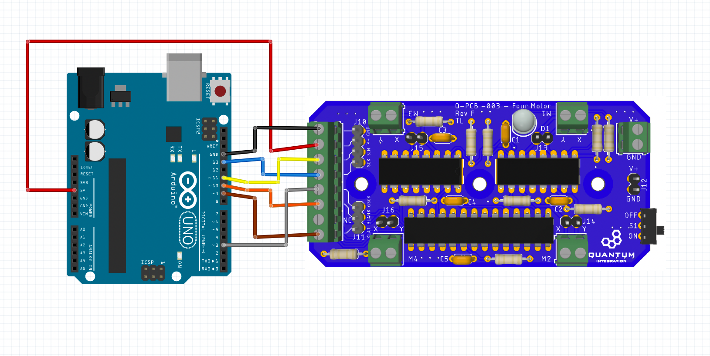
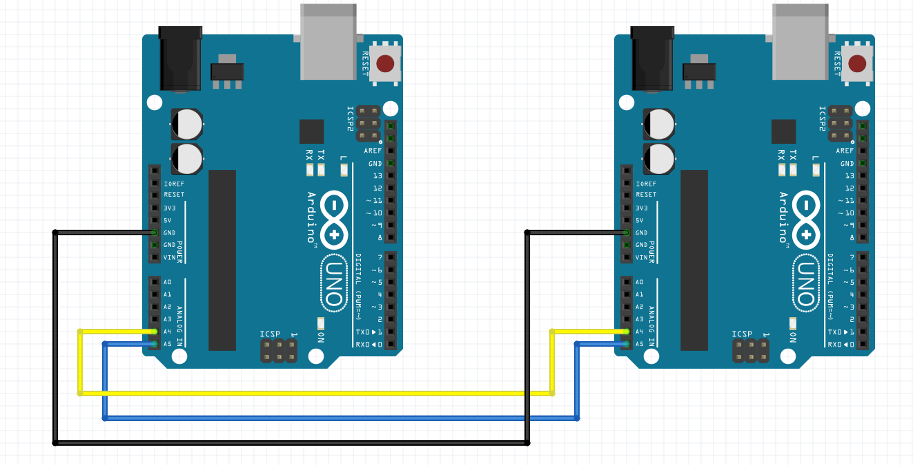

# Example for Arduino usage
## Prerequisites

To build the code for Arduino, we use this [library](https://github.com/sparkfun/SparkFun_TLC5940_Arduino_Library) from [Sparkfun](https://www.sparkfun.com/). A tutorial on how to add the library to your Arduino IDE can be found [here](https://www.arduino.cc/en/guide/libraries).

## Usage

The example is intended to work with the Q-PCB-002 Joystick board. Follow the instructions below to connect the Four Motor board to the Arduino.

The graphic below shows how two Arduinos get connected together via I2C.

